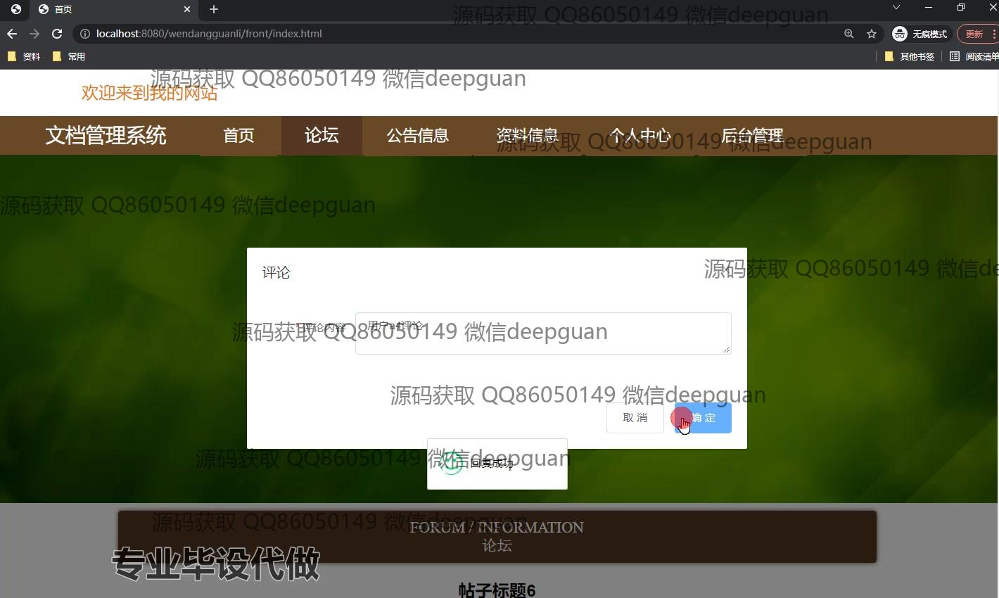

<h1 align="center">江理工文档管理系统的设计与实现</h1>

## 简介
江理工文档管理系统：角色分为管理员、用户；提供文档上传、下载、分类管理、用户权限设置，支持多用户协作，功能模块包括个人中心、资料信息管理、论坛和公告信息管理，系统简洁明了，实现高效管理用户和文档。    --计算机毕业设计源码；毕设源码；java毕业设计源码

## 联系方式

<h3 align="center">获取完整代码与数据库文件 + 微信：deepguan QQ: 86050149 QQ群: 783742310</h3>

<h3 align="center">可帮忙远程部署 包运行成功！提供远程部署、修改代码、设计文档指导、代码讲解等服务！</h3>

## 功能介绍（完整见运行截图）
管理员：管理员具有登录、注册和退出功能，能够管理用户信息和角色权限。在文档管理系统中，管理员负责创建和维护公告信息、资料信息及论坛帖子，确保系统内容的审核和发布。同时，管理员可以进行资料类型管理、后台系统设置以及用户数据查看和修改，还能通过导航栏快速访问系统的不同功能模块。

用户：用户通过注册可以创建账号，并利用登录功能访问文档管理系统。用户能够在个人中心查看和编辑个人信息，包括性别、身份证号、手机号及专业信息，并支持上传个人照片。用户可以浏览和下载系统内的文档资源，参与论坛的讨论和回复，查看公告信息和更新个人资料。此外，用户还可以管理上传的资料信息和查看审核状态，确保信息的完整性和准确性。

游客：游客可以访问文档管理系统的首页浏览公开信息，如公告新闻、资料展示和论坛概况。虽然无法进行互动操作，如评论、下载资料或论坛发帖，但游客可以通过注册成为用户以获得更多功能访问权限。

审核员：审核员负责对用户提交的资料和信息进行审核，通过系统提供的管理界面查看详细资料信息，决定是否通过审核。审核员确保系统内所存资料的质量和真实性，通过导航栏能快速处理待审核的信息请求和文档分类管理任务。

## 运行截图

本代码来源于网络,仅供学习参考使用!

